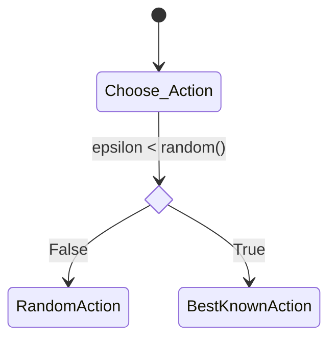
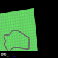

# Solving car racing with reinforcement learning

## Agent 
DQN with experience replay and target network.
- Agent is trained with last `n` frames as input.

Agent is trained with Bellman equation:
This eq tells us how to update Q-table after each step.

### Steps to train agent
1. Initialize main and target neural networks
    - __main neural network__ is used to choose action
    - __target neural network__ is used to calculate Q-value. This has same architecture as main neural network but it's weights are copied from main neural network only every `N` steps. We are using this to stabilize training.
  
1. Choose action using [epsilon-greedy policy](#epsilon-greedy-policy)
2. Evey `M` steps Update main neural network using [Bellman equation](#bellman-equation) and [experience replay](#experience-replay)

#### epsilon-greedy-policy

where:
- `epsilon` - exploration rate. This will decrease over time.

#### Bellman equation

$$Q(s_t, a_t) =(r_t + \gamma \max_a Q(s_{t+1}, a))$$

where:
- $Q(s_t, a_t)$ - Q-value for state $s_t$ and action $a_t$
- $r_t$ - reward for action $a_t$
- $\gamma$ - discount factor. This couses rewards in the future to be less important than immediate rewards.
- $\max_a Q(s_{t+1}, a)$ - maximum Q-value for next state $s_{t+1}$
- $s_{t+1}$ - next state
- $a$ - action
- $t$ - time step

#### NN architecture

- __Input__:  last `n` frames of the game 
- __Output__: Q-value for each action. THIS IS NOT PROBABILITY DISTRIBUTION. We are using this to choose action with highest Q-value.

#### Experience replay

- We are storing each step in memory.
- After each step we are sampling `batch_size` steps from memory and train neural network on them.
- 
## Results
> agent driving like bmw driver after 200 episodes:

